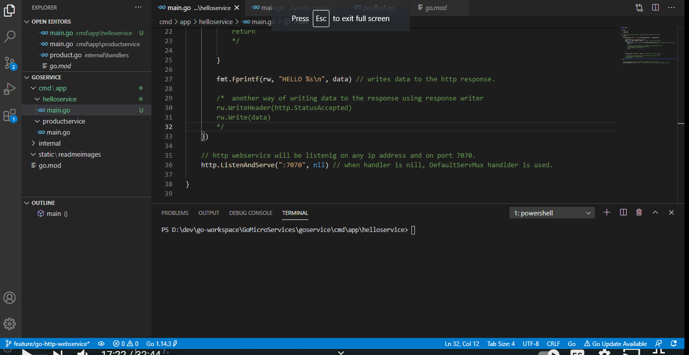

## This feature branch "feature/go-rest-api-crud" has got a GO REST API and built using GO standard libraries.

**Product REST API is exposed with a custom Product handler and a data layer.**

## GET http://<host:port>/v1/products

## POST http://<host:port>/v1/products

## PUT http://<host:port>/v1/products/{productId}

## DELETE http://<host:port>/v1/products/{productId}

<!--

Click for Demo 

-->

