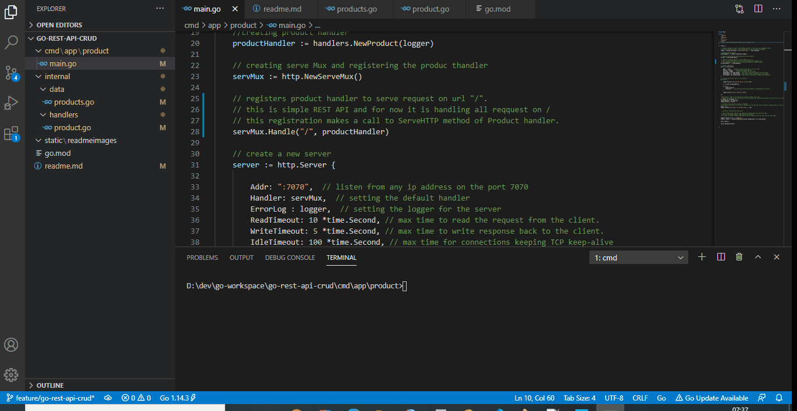

## This feature branch "feature/go-rest-api-crud" has got a GO REST API and built using GO standard libraries.

A simple Product REST API is exposed with a custom Product handler and a data layer. 

Click for Demo 

