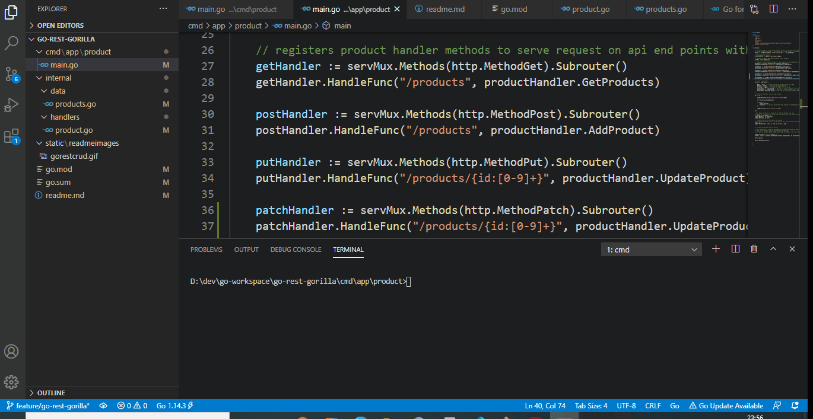

## This feature branch "feature/go-rest-gorilla" has got a GO REST API and using Gorilla Mux library.

A simple Product REST API is exposed with a custom Product handler and a data layer.

GET http://<<host:port>>/products

POST http://<<host:port>>/products

PUT http://<<host:port>>/products/{id}

PATCH http://<<host:port>>/products/{id}

DELETE http://<<host:port>>/products/{id}

Click for Demo 

